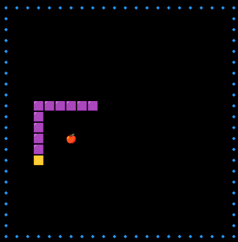
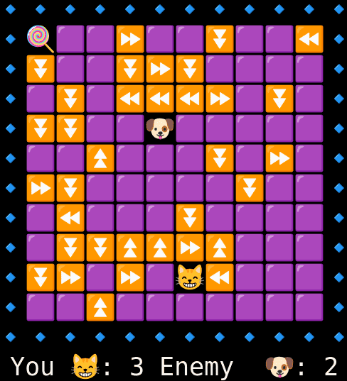

# Oyna 💃🏻🕺🏻💃🏿🕺🏿💃🕺
This repository contains games in Python programming language. The purpose of creating this repository is to include simple computer games written in Python so that everyone can easily access them and learn Python and algorithms in a fun way.

The games that have been added to this repository so far are as follows

<table>
<th>Games List</th>
   <tr>
      <td><a href="./src/oyna/sudoku/"> Sudoku </a>   </td>
      <td><a href="./src/oyna/twenty_forty_eight_2048/">2048</a>   </td>
      <td><a href="./src/oyna/matching/">Matching</a>   </td>
   </tr>
   <tr>
      <td><a href="./src/oyna/minesweeper/"> Minesweeper </a>  </td>
      <td><a href="./src/oyna/find_difference/">Find Difference </a>  </td>
      <td><a href="./src/oyna/maze/"> Maze</a>   </td>
   </tr>
   <tr>
      <td><a href="./src/oyna/memory/"> Memory </a>  </td>
      <td><a href="./src/oyna/snake/"> Snake </a>  </td>
      <td><a href="./src/oyna/chutes_and_ladders/"> Chutes and Ladders </a>  </td>
   </tr>

</table>

To add a game, you can read the [CONTRIBUTING.rst](./CONTRIBUTING.rst) file and then proceed to create a new game and send a pull request.
