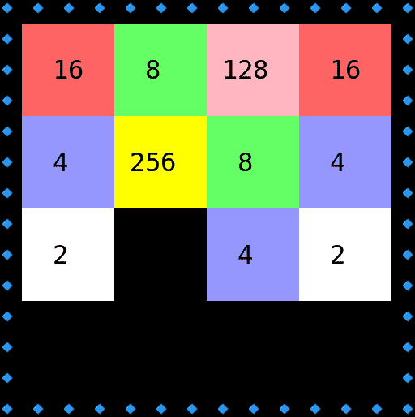
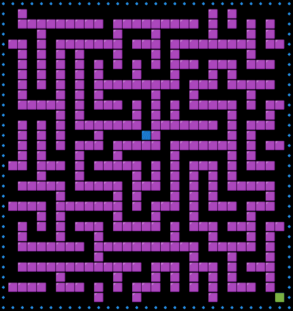
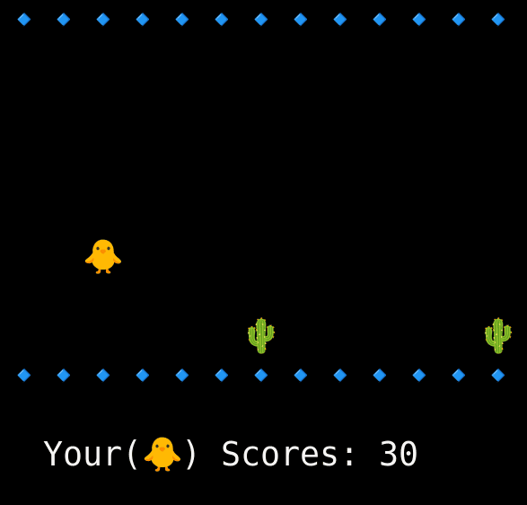
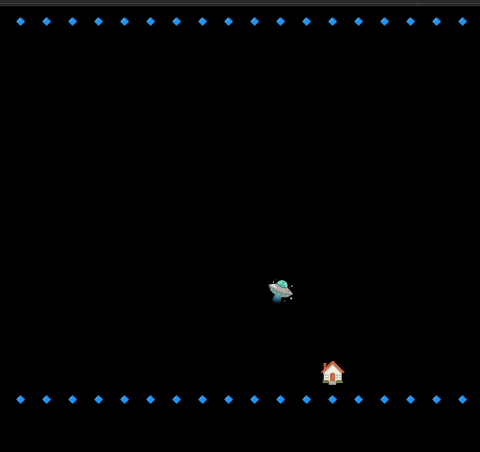

# Oyna 💃🏻🕺🏻💃🏿🕺🏿💃🕺
This repository contains games in Python programming language. The purpose of creating this repository is to include simple computer games written in Python so that everyone can easily access them and learn Python and algorithms in a fun way.

The games that have been added to this repository so far are as follows:

<table>
   <tr>
      <td><a href="./src/oyna/sudoku/"> Sudoku </a>   </td>
      <td><a href="./src/oyna/twenty_forty_eight_2048/">2048</a>   </td>
      <td><a href="./src/oyna/matching/">Matching</a>   </td>
   </tr>
   <tr>
      <td><a href="./src/oyna/minesweeper/"> Minesweeper </a>  </td>
      <td><a href="./src/oyna/find_difference/">Find Difference </a>  </td>
      <td><a href="./src/oyna/maze/"> Maze</a>   </td>
   </tr>
   <tr>
      <td><a href="./src/oyna/chimp/"> Chimp </a>  </td>
      <td><a href="./src/oyna/snake/"> Snake </a>  </td>
      <td><a href="./src/oyna/chutes_and_ladders/"> Chutes and Ladders </a>  </td>
   </tr>
   <tr>
      <td><a href="./src/oyna/dino/"> Dino or Dinosaur Game </a> </td>
      <td><a href="./src/oyna/bubble_shooter/"> Bubble Shooter </a> </td>
      <td><a href="./src/oyna/flappy_bird/"> Flappy Bird </a>  </td>
   </tr>
   <tr>
      <td><a href="./src/oyna/falling_tower/"> Falling Tower </a> </td>
      <td><a href="./src/oyna/shoot_colors/"> Shoot Colors </a> </td>
      <td><a href="./src/oyna/reversi/"> Reversi </a> 
      </td>
   </tr>
   <tr>
      <td><a href="./src/oyna/supermario_pixel/"> SuperMario Pixel </a> </td>
      <td><a href="./src/oyna/tetris/"> Tetris </a> 
      </td>
      <td><a href="./src/oyna/explosion/">UFO Explosion </a> </td>
   </tr>
   <tr>
      <td><a href="./src/oyna/reverse_slide_puzzle/"> Reverse Slide Puzzle </a> 
      </td><td><a href="./src/oyna/tik_tok_toe/"> Tik Tok Toe </a> </td>

   </tr>

</table>

To add or refactor a game or any other feature, please read the [CONTRIBUTING.md](./CONTRIBUTING.md) file first. After that, you can create a new game or make changes and submit a pull request.
