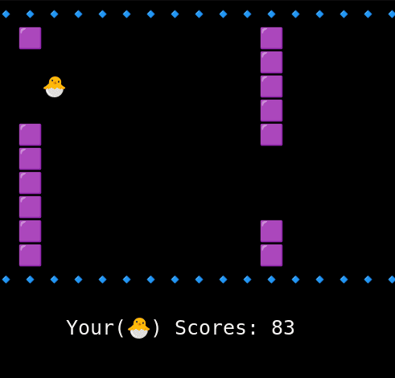

# [Flappy Bird](https://en.wikipedia.org/wiki/Flappy_Bird)

From Wikipedia, the free encyclopedia

Flappy Bird is a 2013 casual mobile game developed by Vietnamese video game artist and programmer Dong Nguyen (Vietnamese: Nguyễn Hà Đông), under his game development company .Gears. The game is a side-scroller where the player controls a bird attempting to fly between columns of green pipes without hitting them. The player's score is determined by the number of pipes they pass. Nguyen created the game over a period of several days, using the bird from a cancelled game made in 2012.

The game was released in May 2013 but received a sudden spike in popularity in early 2014, becoming a sleeper hit. Flappy Bird received poor reviews from some critics, who criticized its high level of difficulty and alleged plagiarism in graphics and game mechanics, while other reviewers found it addictive. At the end of January 2014, it was the most downloaded free game in the App Store for iOS. During this period, its developer said that Flappy Bird was earning $50,000 a day from in-app advertisements as well as sales.

Flappy Bird was removed from both the App Store and Google Play on February 10, 2014, with Nguyen claiming that he felt guilty over what he considered to be the game's addictive nature and overusage. Its popularity and sudden removal caused phones with the game installed before its removal to be put up for sale for high prices over the Internet. Clones of Flappy Bird became popular on the App Store after the original app's removal, and both Apple and Google have removed games from their app stores for being too identical.

In August 2014, a revised version of Flappy Bird, called Flappy Birds Family, was released exclusively for the Amazon Fire TV. Bay Tek Games also released a licensed coin-operated Flappy Bird arcade game.

## [Grid Base:](./grid_base.py)

### How to Implement
This game is implemented as a grid table where elements are connected with their neighbors through links. When any button is pressed, the bird jumps and can pass through the distance between the blocks. To move blocks, the status of the block element is changed to `EMPTY` and the status of the left element is changed to `BLOCK`, If the block hits the bird, you lose.

### How to Play:
•  Press `any key` to move up like `w` or `up arrow`

•  Press `ctrl + c` to exit

### Requirements:
`pynput`

### How to Run
Run the command: `python ./grid_base.py`

